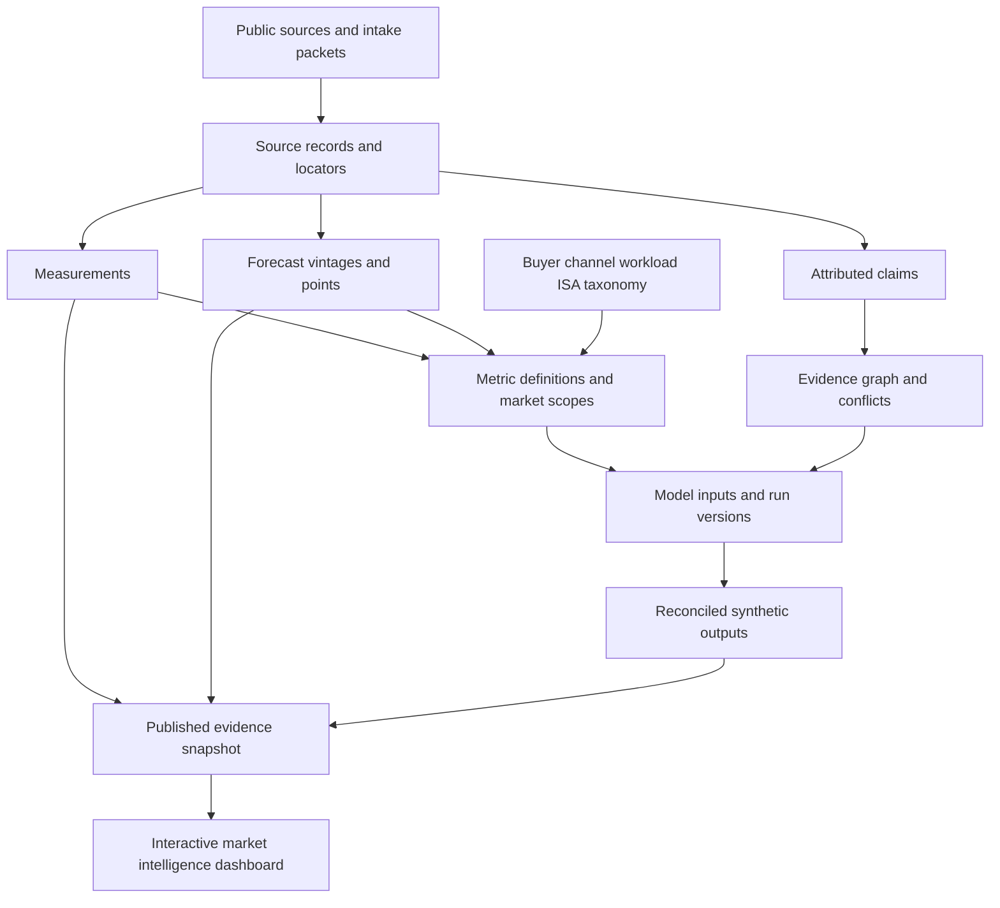

# Database architecture: evidence warehouse, segmentation cube, and model graph

**Architecture decision 001, 2026-10-08:** SQLite + Python stdlib v1, deterministic local seed from existing Git; PostgreSQL 16+ *target* for controlled multi-writer service when justified. No second source-of-truth today. The static dashboard remains read-only and independently deployable.

## Five layers

1. **Acquisition/identity:** `ingestion_batches`, `source_documents`, `source_locators` track where a claim originated, its publication/vintage/access status, and its import SHA. Restricted source documents are *not* stored or duplicated in this public project.
2. **Evidence:** `evidence_claims` (who said what) and `measurements` (a particular numerical observation at a typed boundary, period, source, denominator, qualifier). `forecast_vintages` + `forecasts` isolate future projections.
3. **Market ontology:** `taxonomy_axes`, `taxonomy_nodes`, `scope_dimensions`, `market_scopes`, `metric_definitions`. Buyer, procurement channel, workload, ISA and deployment are orthogonal axes. A hierarchy is not automatically an additive partition.
4. **Models and graph:** `calculation_models`, `model_runs`, `model_inputs`, `model_outputs`, `model_dependencies`, `partition_frames` and `partition_allocations`. Generic `objects` + `knowledge_edges` provide cross-type provenance and hypothesis/counterevidence links.
5. **Review and delivery:** `hypotheses`, `research_questions`, `conflicts`, `review_events`, `legacy_links`; read-only views and a static JSON snapshot for dashboards. No automatic publication gate bypass.

## Normalized tables, not JSON-only EAV

The core fact grain is **one reported measurement per source, publication version, exact metric, scoped population, time period, unit, and qualifier**. It is not “server market in 2026” without a publisher or accounting boundary. `value_decimal TEXT` retains exact base-10 digits and large token counts; calculations in code must use `Decimal` rather than floating-point SQL aggregates. The `quantity_kind` and `expected_boundary` columns prevent treating USD of *complete systems* as USD of *CPU silicon*.

Claims can include executive statements, hardware spec assertions, demos or unverified transcripts. A claim about a number does not automatically create an accepted measurement. Forecasts are issued-vintage series, not revisions of real history. A forecast with qualifier `greater_than` is a **lower-bound inequality**, not an exact point.

Some market facts are not directly observed. Preserve `missing`, `unresolved`, access status and contradiction; do **not** impute from 2030 TAM or from different vendors' company segment totals without a separate documented model.

## Axis semantics and non-double-counting

Use [canonical market taxonomy](../../docs/research/demand-2030/TAXONOMY-AND-ACCOUNTING.md). A hyperscaler may be an economic buyer via an ODM; the ODM is a *channel*, not additional CPU demand. Model labs consuming neocloud services may not be the owner of physical hardware. Workload classifications can overlap on an existing socket (CPU inference, RAG, governance); physical socket attribution cannot be counted once for every software activity.

A node hierarchy (`isa:all` → `isa:x86`/`isa:non_x86`) describes **membership**, whereas a `partition_frame` asserts a named and bounded additive allocation across mutually exclusive children. The validator checks that every checked partition sums to one. A single record tagged with buyer, ISA, workload and geography is one multidimensional observation—not four independent amounts. For source records with uncertain segment denominators, keep original market scope as an opaque string and defer classification.

**Coverage-aware accounting:** 2025 IDC x86 and non-x86 *whole-system* values are compatible only within the same IDC version/period. They are **never** added to the AMD 2030 *CPU silicon* TAM. A company reported annual revenue cannot be added as a share of CPU chip revenue without a conversion verified by chip unit prices/volume.

## Typed graph and temporal truth

`objects` registers IDs; `knowledge_edges` stores `supports`, `contradicts`, `derived_from`, `revises`, etc. `source_documents` has a source publication date; a legacy import has a received timestamp; each observation has its original fiscal or calendar period label. Model runs have a code/dataset snapshot SHA. These are different time dimensions, never collapsed into a single `date`.

**Bitemporal roadmap (not v1 claim):** validity intervals + ingestion/review timestamps, revision objects, effective-dated buyer/ISA taxonomies, and per-release SQL views. Avoid in-place updates to a historical estimate; introduce a new record/vintage and a lineage edge, after review.

## Query risks and safe computational shape

For a segmented 2030 model, start with nonoverlapping **foundational**, **AI host**, **dedicated incremental agent CPU** pools. Model each branch independently; subtract capacity reuse and Arm substitution *once*. Convert core-hours into sockets using provisioned utilization and usable physical cores/socket, then apply a dated *realized net* ASP range if observable. Unavailable ASP is an uncertainty variable, not zero. Model output carries scenario name, year, unit, model version, inputs, and source references.

For cross-sectional slice-and-dice, use an API/query planner that knows `aggregation_rule`, full population, units and disjoint partition frame before summing. SQLite does not provide a magic safe group-by: **the application must reject aggregation outside a declared comparable partition**.

## Deployment boundary

- V1 is a **local, reproducible seed**, not a remotely accessible database. Do not attach it directly to a public browser; the frontend consumes approved, read-only snapshots.
- Avoid committing `.sqlite`, imported transcripts or credentials.
- Research agents continue to stage packets under `research/packets/` until a reviewer grants promotion. DB seed mirrors published Git data only.
- Future API should expose read-only query endpoints and explicit reviewer-only transaction commands with authentication and audit logs. See [API contract](API-AND-QUERY-CONTRACT.md).
