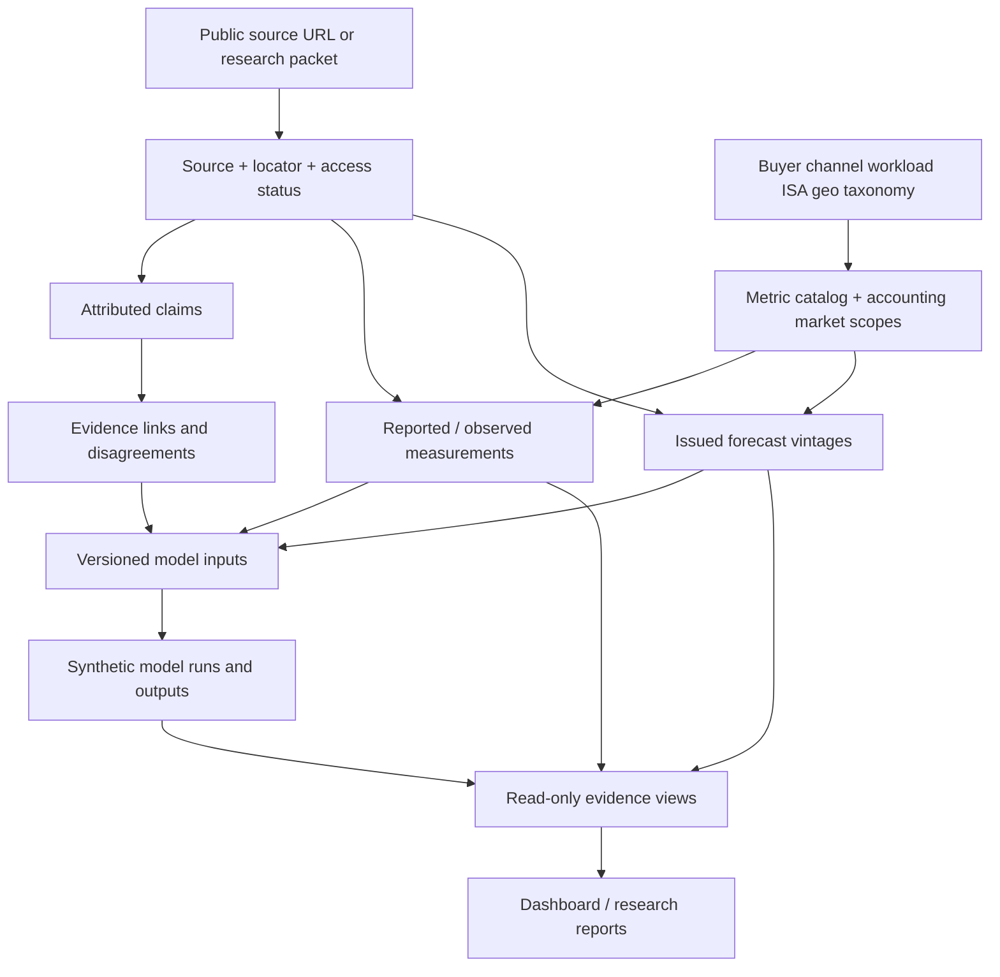

# Relational research database v1 — architecture

## Why this is not one wide spreadsheet

The project has potentially conflicting **micro measurements** (successful agent workflow core-seconds, RAM, energy, isolation overhead), **market observations** (vendor units, revenue share, cloud instance prices, OEM data), **attributed assertions** (keynotes, announcements), **forward estimates** (dated analyst/management TAM forecasts), and **analyst models** (back-of-envelope allocation assumptions and scenarios).

These are different evidence types with different provenance, units and decision authority. Store them separately and join them deliberately.

## Core v1 tables (working implementation bundle)

| Area | Main tables | Role |
| --- | --- | --- |
| Ingestion | `schema_migrations`, `ingestion_batches`, `legacy_links` | Checksummed releases and stable mapping from existing JSON/CSV IDs |
| Provenance | `objects`, `source_documents`, `source_locators` | Canonical origin, publication/access rights, PDF page/video timestamp/transcript line |
| Claims | `evidence_claims` | Speaker/vendor's statement and verification state; **not assumed true** |
| Quantitative facts | `metric_definitions`, `market_scopes`, `measurements` | Decimal value, unit, fiscal/calendar period, scope and denominator, qualified evidence |
| Forecasts | `forecast_vintages`, `forecasts` | One immutable issued-vintage estimate per target horizon/market/metric |
| Segmentation | `taxonomy_axes`, `taxonomy_nodes`, `scope_dimensions`, `entity_segments` | Hierarchical, orthogonal buyer/channel/ISA/workload/deployment classifications |
| Commercial networks | `entities`, `entity_relationships`, `entity_aliases` | OEM ↔ supplier, customer ↔ operator, standards members, dated status |
| Models | `calculation_models`, `model_runs`, `model_inputs`, `model_outputs`, `model_dependencies` | Explicit synthetic assumption snapshots, what changed and which sources informed it |
| Safe allocation | `partition_frames`, `partition_allocations` | A declared mutually exclusive subset whose weights must total 1, independently of overlapping tags |
| Truth maintenance | `hypotheses`, `research_questions`, `conflicts`, `knowledge_edges`, `review_events` | Contradictions, counterevidence, falsification and approval audit |
| Delivery | `v_measurement_evidence`, `v_forecast_history`, `v_synthetic_outputs` | Separate read-only query surfaces for the frontend |

### Actual fact grain

A measurement means: **publisher/source version + metric definition + exact market population and denominator + period (fiscal or calendar) + unit + qualifying inequality/status + decimal value**.

A forecast adds: **issuer + publication vintage + target period + scenario/inequality**. It never overwrites a previously issued forecast.

A model output adds: **immutable calculation run + dataset/code hash + assumptions + target year + unit + synthetic status**.

A graph relationship means a factual/attributed linkage with supporting sources and validity dates; graph links cannot create an observed numerical value.

## Datatypes and integrity

The first SQLite schema uses strict tables, foreign keys and hierarchy/axis triggers. Values are stored as **decimal strings** and parsed with Python `Decimal` so that tiny ratios and huge token volumes aren't truncated by floating-point casts. Aggregation still requires validated units and denominators; the database cannot make an invalid SUM meaningful simply by allowing it in SQL.

Source IDs remain stable. If the underlying figure or definition changes at the same legacy ID, the seed loader raises an immutable-ID collision rather than silently substituting a new fact. Adding unrelated new source rows is supported without rewriting the existing evidence.

**Source staleness and license are first-class:** secondary/paid claims remain distinguished from audited filings. Local transcript pointers are explicitly marked unavailable outside their original session; the database doesn't manufacture public URLs for uploaded files.

## Roadmap: from lightweight local database to multiuser service

**Stage 1 (now):** SQLite mirror generated from existing Git datasets. No new public interface or backend credentials.

**Stage 2:** Ingest research packets with explicit human review and provenance; add a typed dimensional query planner that blocks unrelated units or overlapping segment sums, source version diffs and a benchmark event collector.

**Stage 3:** Execute immutable model DAGs with ranges, probability distributions, backtests, counterfactuals and transparent sensitivity/elasticity analysis; add lineage-aware search and UI.

**Stage 4:** PostgreSQL for concurrent writers and remote review; preserve stable IDs, source-vintage lineage and exact Decimal semantics through dual-run reconciliation. Optional DuckDB for large analytical materializations. Vector retrieval only if the evidence volume warrants it.

This is a **schema architecture**, not a claim that a live PostgreSQL service, query API or automated agent-ingestion backend has already been implemented.
